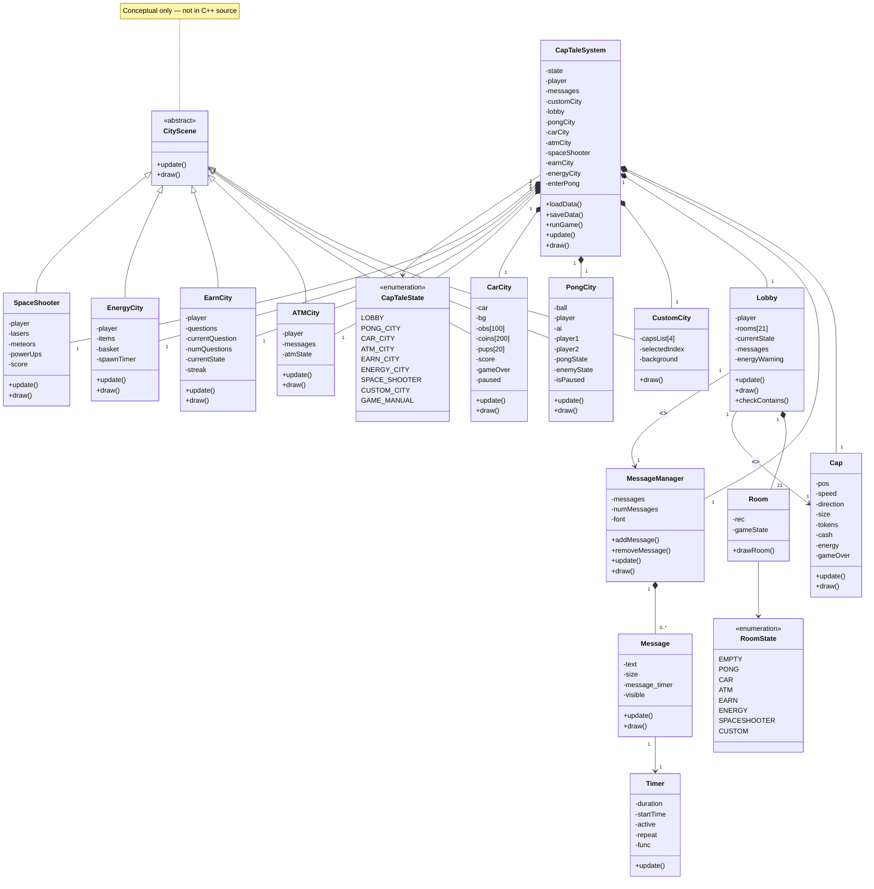
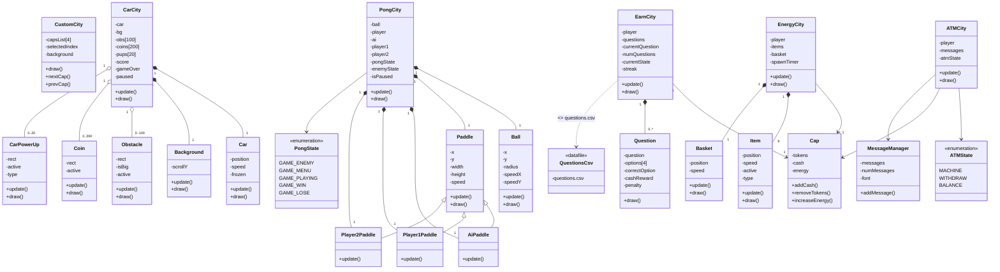
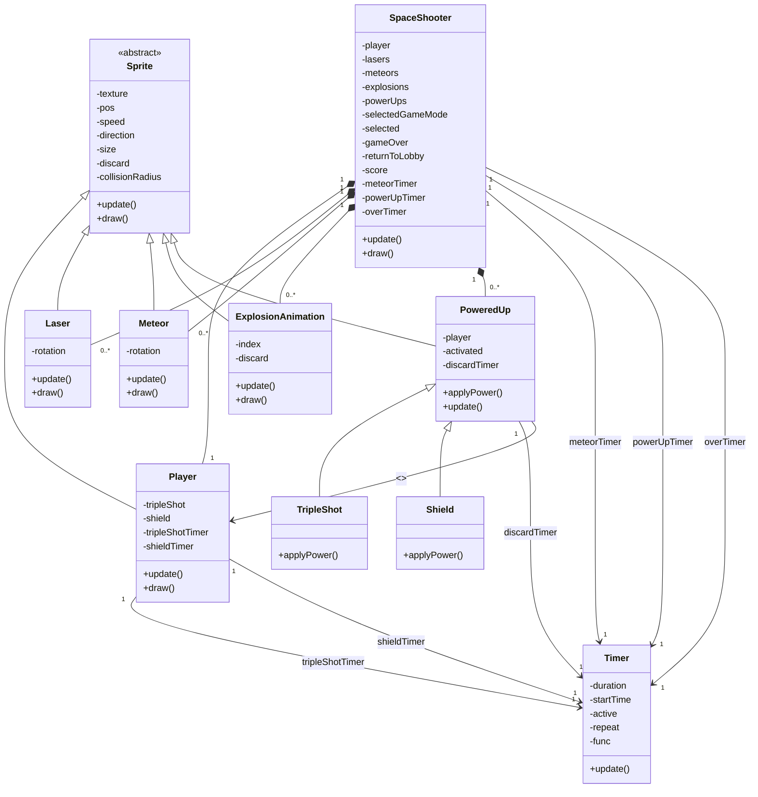

# CapTale Class Diagram Specification

---

## 1. Core System Classes

```
CapTaleSystem
Cap
Lobby
Room
MessageManager
Message
CustomCity
PongCity
CarCity
ATMCity
EarnCity
EnergyCity
SpaceShooter
Timer
CityScene (conceptual only)
```

---

## 2. Inheritance Structure

### City Modules

```
CityScene <|-- CustomCity
CityScene <|-- PongCity
CityScene <|-- CarCity
CityScene <|-- ATMCity
CityScene <|-- EarnCity
CityScene <|-- EnergyCity
CityScene <|-- SpaceShooter
```

### Paddle Hierarchy

```
Paddle <|-- AiPaddle
Paddle <|-- player1Paddle
Paddle <|-- player2Paddle
```

### Sprite System

```
Sprite <|-- Player (shooter)
Sprite <|-- Laser
Sprite <|-- Meteor
Sprite <|-- PoweredUp
Sprite <|-- ExplosionAnimation (optional)
```

### PowerUps

```
PoweredUp <|-- TripleShot
PoweredUp <|-- Shield
```

---

## 3. CapTaleSystem Attributes

* state
* player
* messages
* customCity
* lobby
* pongCity
* carCity
* atmCity
* spaceShooter
* earnCity
* energyCity
* enterPong

---

## 4. Cap Class

* pos
* speed
* direction
* size
* tokens
* cash
* energy
* gameOver

---

## 5. Lobby & Room

### Lobby

* player
* rooms[21]
* currentState
* messages
* energyWarning

### Room

* rec
* gameState

---

## 6. Messaging System

### MessageManager

* messages
* numMessages
* font

### Message

* text
* size
* message_timer
* visible

---

## 7. CustomCity

* capsList[4]
* selectedIndex
* background

---

## 8. PongCity

### PongCity

* ball
* player
* ai
* player1
* player2
* pongState
* enemyState
* isPaused

### Ball

* x, y, radius
* speedX, speedY

### Paddle

* x, y
* width, height
* speed

---

## 9. CarCity

### CarCity

* car
* bg
* obs[100]
* coins[200]
* pups[20]
* score
* gameOver
* paused

### Car

* position
* speed
* frozen

### Obstacle

* rect, isBig, active

### Coin

* rect, active

### PowerUp

* rect, active, type

### Background

* scrollY

---

## 10. ATMCity

* player
* messages
* atmState

---

## 11. EarnCity

* player
* questions
* currentQuestion
* numQuestions
* currentState
* streak

### Question

* question
* options[4]
* correctOption
* cashReward
* penalty

---

## 12. EnergyCity

* player
* items
* basket
* spawnTimer

### Item

* position
* speed
* active
* type

### Basket

* position
* speed

---

## 13. SpaceShooter

* player
* lasers
* meteors
* explosions
* powerUps
* selectedGameMode
* selected
* gameOver
* returnToLobby
* score
* meteorTimer
* powerUpTimer
* overTimer

### Sprite Base

* texture
* pos
* speed
* direction
* size
* discard
* collisionRadius

### Player (Shooter)

* tripleShot
* shield
* tripleShotTimer
* shieldTimer

### Laser

* rotation

### Meteor

* rotation

### ExplosionAnimation

* index
* discard

### PoweredUp

* player
* activated
* discardTimer

---

## 14. Timer

* duration
* startTime
* active
* repeat
* func

---

## 15. Relationships (Multiplicities)

### System Core

* CapTaleSystem 1—1 Cap
* CapTaleSystem 1—1 Lobby
* CapTaleSystem 1—1 MessageManager
* CapTaleSystem 1—1 each City module

### Lobby

* Lobby 1—1 Cap
* Lobby 1—1 MessageManager
* Lobby 1—21 Room

### Messages

* MessageManager 1—0..* Message
* Message 1—1 Timer

### Cities

* ATMCity 1—1 Cap, MessageManager
* EarnCity 1—1 Cap, 0..* Question
* EnergyCity 1—1 Cap, 9 Item, 1 Basket

### PongCity

* 1 Ball
* 1 Paddle
* 1 AiPaddle
* 1 player1Paddle
* 1 player2Paddle

### CarCity

* 1 Car
* 1 Background
* 0..100 Obstacle
* 0..200 Coin
* 0..20 PowerUp

### SpaceShooter

* 1 Player
* 0..* Laser
* 0..* Meteor
* 0..* ExplosionAnimation
* 0..* PoweredUp
* 3 Timer

---

## Implemented Mermaid Class Diagrams

### Diagram 1 — Core Orchestration



This layer captures top-level orchestration, and the most important structural decision is modeling `CapTaleSystem` as the owner of all shared runtime modules.

### Diagram 2 — City Internals



This layer captures per-city gameplay structure, and the most important structural decision is separating bounded city compositions (Pong/Car/Energy/Earn/ATM) with exact multiplicities.

### Diagram 3 — Sprite & Shooter Subsystem



This layer captures shooter-runtime entity composition and polymorphism, and the most important structural decision is isolating the `Sprite` inheritance chain from top-level city orchestration.
